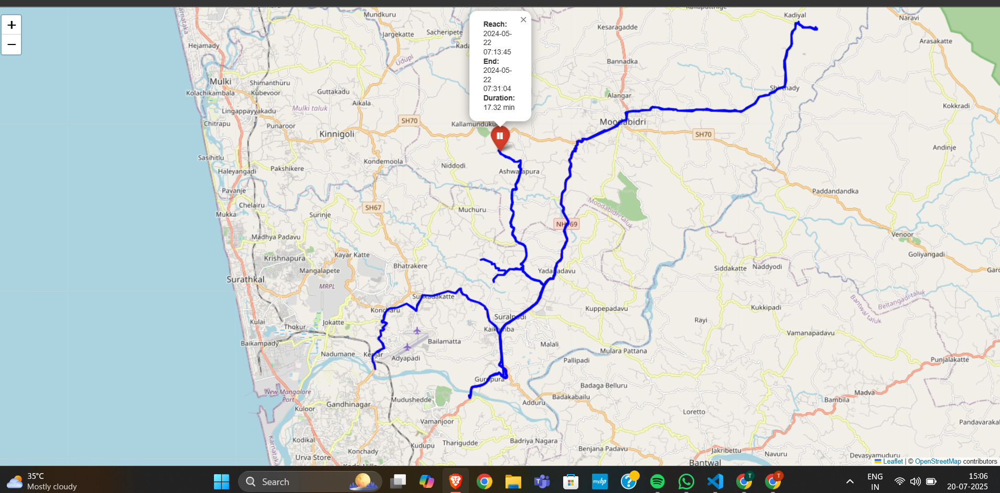

# 🚗 Vehicle Stoppage Identification and Visualization

This web application helps users analyze GPS tracking data from vehicles to detect **stoppages** and **visualize them on an interactive map**. Users can upload an Excel (.xlsx) file with GPS data, and the system identifies stops based on a user-defined time threshold.

---

## 📸 Screenshots

### 🔼 Input Interface


### 📍 Output Map with Stoppages


---

## 🧩 Features

- 📁 Upload `.xlsx` GPS data.
- 🕒 Set stoppage threshold in minutes.
- 🗺️ Interactive map using **Leaflet** to visualize:
  - Vehicle routes
  - Marked stoppage points with timestamps and durations
- 💡 Modern, dynamic background UI using CSS gradients.

---

## ⚙️ Technologies Used

- Python (Flask)
- Pandas, OpenPyXL for Excel parsing
- Folium for map rendering
- HTML5, CSS3 for frontend
- Leaflet.js for dynamic maps

---

## 📂 File Structure

```
├── app.py               # Main Flask backend
├── templates/
│   └── index.html       # Upload form page
├── static/
│   └── style.css        # CSS styling for the UI
├── uploads/             # Uploaded Excel files (temporary)
├── output/
│   └── map.html         # Generated interactive map
└── README.md            # This file
```

---

## 📝 How to Run

1. 🔧 Install requirements:
   ```bash
   pip install flask pandas openpyxl folium
   ```

2. ▶️ Run the app:
   ```bash
   python app.py
   ```

3. 🌐 Open in your browser:
   ```
   http://127.0.0.1:5000
   ```

---

## 📌 Input Format (Excel)

| Timestamp           | Latitude  | Longitude |
|---------------------|-----------|-----------|
| 2024-05-22 07:13:45 | 13.03671  | 74.99341  |
| ...                 | ...       | ...       |

---

## 📊 Output

- Blue lines → Vehicle movement
- Red markers → Detected stoppages with:
  - Start and End time
  - Total duration

---

## 🚀 Future Enhancements

- Export stoppage reports to PDF/CSV
- Real-time vehicle tracking
- Mobile responsive design

---

## 📬 Contact

**Developer:** Tarun Naik  
📧 [Your email or GitHub link]
